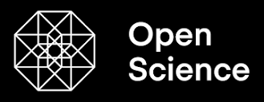

# sc-gio

This is the docs repo of the Open Science project.

WIP: Its very much a work in progress as we try approaches out. Contact me if your interested.

Mermaid sequence diagrams to come soon.

## Aims

- Reproducibility: GUI, Logic and Data all in one place, allowing Scienists to review each others work.

- Accessibility: Easy to use, and run locally in your Lab , with a Public Entry point to allow the public to participate.

- Secure: Accounts to control who can see and do what.

## Usage 

From an Editors perspective it's made up of:

- Editor and Renderer

- Logic 

- Data

- Bus

### Editor

The GUI to allow you to edit the source via a WYSIWYG GUI that runs anywhere WASM runs such as Web, Desktop, Mobile.

Real time Collaboration: The IDL describing your GUI is synchronised with others usrs using OT ( Operational Transforms ). The Project on yor disk is the master, and your letting other edit your master. Other users reach you via QUIC Web Transport.

Non Real Time Collaboration: Each Proejct is saved to your disk disk and is a git repo, so that you can use git for non real time collaboration. 

Mutations: When you change a Widget or data binding in the Editor , we rewrite the IDL source and the Renderer redraws diffing and merging from the previosus frame render.  The history is saved via the OT tree.

Actors: A User that is using an App that you created in the Editor is the exact Runtoe and IDL code. So if they have edit rights, they can fork and edit the Project also. This is all done seamlessly for them.

### Renderer

All rendering is GPU accelerated for Online and Offline rendering.

OnLine Rendering: Its fast enough to do animations on most modern machines. 

Off Line rendering: For Video outout or massive lasrge PDF or Images, the Edit history is used as a Non Linear Editor, so that you can render at 4 K if needed. 

Render targets are: WASM ( Web, Mobile Desktop, TV ), PDF, PNG, SVG, Web and Video. This is a type of Single Sourcing because a single IDL can produce all these outputs.

Render Target Reuse: You can reuse the outputs as inputs. For example a Project can import a Video or PNG, do work with them and output other things. 

Project Modules: This reuse is a Module system, with a Registry, allowing you to find Projects and import them into your proejct. 

Its a turtles all the way down system.

### Logic ( UDF: User Defiend Functions )

Developers write logic in any language that compiles to WASM.

The code is compiled to WASM on the fly, via the Cloud Server, and synced back to your local disk.

That WASM can then be utilised in the GUI or the Backend ( Simpe process watchig your local disk )

### Data

All data is saved as pointers in the Git Repo with the real data on the backend S3 Server. This is just a Git LFS, and so the real data is actually stored in an S3 running locally or remotely.

The data types are: PDF, SVG, Images, Video, WASM, JSON, Projects.

Interestly, the Output from the Editor is the same data types. So the S3 can save GUI and Logic build outputs as well as the working JSON data. 

JSON data is used as a Database with SIMD acceleration for speed of indexing and parsng with a SQL language for Queries and mutations. 

A GraphQL database can also be froentend in front of the JSON Database allowing Queries, Subscriptions, Mutations on everything.

The GUI Data Editor that looks like a Google sheet is provided. WASM Functions to do mutations on cells are WASM functions that are pipelined by the Bus. 

Modules: By joining up Data via WASM functions, your able to reuse WASM to create larger sheets.

Reuse: Sheets can then be virtual, allowing Materilaised Sheets to be creatd from other sheets.

### Bus

The Bus is the transport between parts of the above system.

There are 2 bus implementations:

- In Process: Between the GUI and the File system.

- Out of Process: Between you machine and other machines is the NATS bus.

The Bus is a Pub Sub system with the Producer and Consumer decoupled at Design time. We wire them up at Runtime. A Manifest described this Logical to Physical coupling that the Rune Time uses.

So all Endpoints are virtual wih Bus control plane joining the virtual Endpoints up to real Endpoints at runtime. These Actors are described in a Manifest and then enforced by the Runtime using the Security system and control plane.

A Producer can be the Data Layer or the GUI Layer. 

A Consumer can be the Data Layer or the GUI Layer. 

Computaion using the Logic embodied in the WASM is pipelined between virtual endpoints, allowing you to do Computation, and surface data change events in the GUI. 

Mutations are DATA Change chaneg events onto the data, that are use standad Chaneg Data Detection to 

### Regitry

Every artifact of the system can be found and reused by others.

Projects: You can import another Project into your project. 

Projects Targets: You can reuse the outputs of someones elses Project in your Project for the GUI or the Data layer.

Data: You can reuse the Data from one Proejct another Project.

Data Target: You can reuse the Data from someones elses Project in your Project 

## Dependencies

The go-app  project( https://go-app.dev ) that allows building high quality GUI.

The GIO pluigns ( https://github.com/gioui-plugins/gio-plugins ) that provide the needed OS level GUI integrations.

## Network Topology

The system is a quasi decentralised network with the following structure.

In the Lab:

- A **NATS Leaf Server**.
  - When a new message is published to the NATS Server, it processes the message, does any computation, and updates the GUI. The GUI is a consumer of the post computation Messages.

In the Cloud:

- A **Web Server**.
  - Loads the GUI from in the Lab for Users.
- A **NATS Server**.
  - Brokers messages from this **NATS Server** to / from the NATS Leaf Server in the Lab.

In the users Browser:

- The **GUI**.
  - Serves the IDL
  - Loads the data from the **NATS Server** in the Cloud.

Other Labs:
- Run the same topology as above, allowing them to publish messages to and from other Labs.

